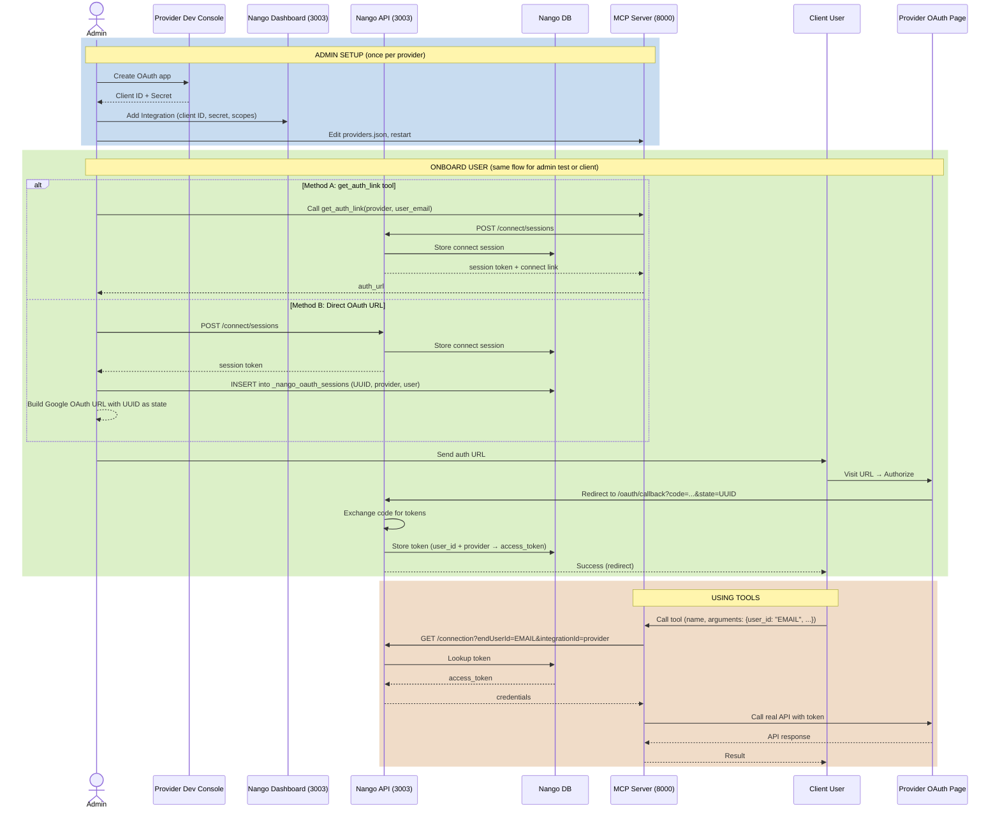

```mermaid
sequenceDiagram
    actor Admin
    participant DevConsole as Provider Dev Console
    participant NangoDash as Nango Dashboard (3003)
    participant NangoAPI as Nango API (3003)
    participant DB as Nango DB
    participant MCPServer as MCP Server (8000)
    participant User as Client User
    participant ProviderOAuth as Provider OAuth Page

    rect rgb(200, 220, 240)
        Note over Admin,MCPServer: ADMIN SETUP (once per provider)
        Admin->>DevConsole: Create OAuth app
        DevConsole-->>Admin: Client ID + Secret
        Admin->>NangoDash: Add Integration (client ID, secret, scopes)
        Admin->>MCPServer: Edit providers.json, restart
    end

    rect rgb(220, 240, 200)
        Note over Admin,ProviderOAuth: ONBOARD USER (same flow for admin test or client)

        alt Method A: get_auth_link tool
            Admin->>MCPServer: Call get_auth_link(provider, user_email)
            MCPServer->>NangoAPI: POST /connect/sessions
            NangoAPI->>DB: Store connect session
            NangoAPI-->>MCPServer: session token + connect link
            MCPServer-->>Admin: auth_url
        else Method B: Direct OAuth URL
            Admin->>NangoAPI: POST /connect/sessions
            NangoAPI->>DB: Store connect session
            NangoAPI-->>Admin: session token
            Admin->>DB: INSERT into _nango_oauth_sessions (UUID, provider, user)
            Admin-->>Admin: Build Google OAuth URL with UUID as state
        end

        Admin->>User: Send auth URL
        User->>ProviderOAuth: Visit URL → Authorize
        ProviderOAuth->>NangoAPI: Redirect to /oauth/callback?code=...&state=UUID
        NangoAPI->>NangoAPI: Exchange code for tokens
        NangoAPI->>DB: Store token (user_id + provider → access_token)
        NangoAPI-->>User: Success (redirect)
    end

    rect rgb(240, 220, 200)
        Note over User,MCPServer: USING TOOLS
        User->>MCPServer: Call tool (name, arguments: {user_id: "EMAIL", ...})
        MCPServer->>NangoAPI: GET /connection?endUserId=EMAIL&integrationId=provider
        NangoAPI->>DB: Lookup token
        DB-->>NangoAPI: access_token
        NangoAPI-->>MCPServer: credentials
        MCPServer->>ProviderOAuth: Call real API with token
        ProviderOAuth-->>MCPServer: API response
        MCPServer-->>User: Result
    end
```
